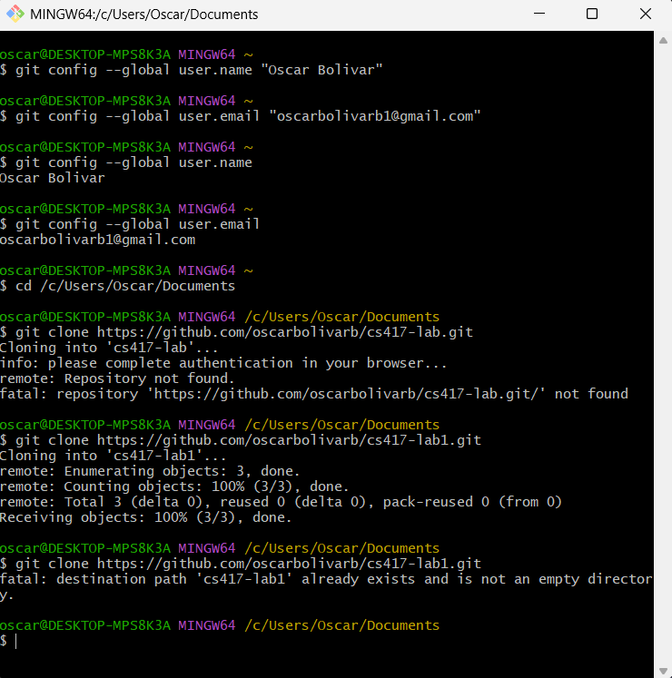

# Git Setup and Workflow Documentation

## 1. Repository Setup

For this lab, the repository was created in Github and then it was cloned to my computer using Git Bash. This allowed me to connect the online repository to my local computer so I could work on the files and push changes back to GitHub. 

**Git Command Used**

`git clone https://github.com/oscarbolivarb/cs417-lab1.git`

**Screenshot**

Feature branch change.